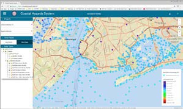
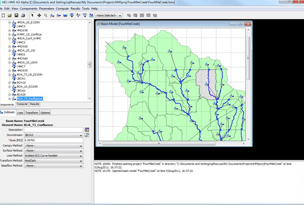

<table style="width:100%", border="0", cellpadding="5">
<caption style="font-size: 20px">Fact Sheets</caption>
<tr>
<td align="left", valign="center">
<body>

  
• Beach-fx and G2CRM

</body>
</td>
<td id="mytable", rowspan="8">

  

  

</td>
</tr>

<tr>
<td align="left", valign="center">
<body>

  <a href="06.19_FY19_AltAnalysisRisk_HMS-Uncertainty_Scharffenberg.pdf" target="_blank">• HEC-HMS Uncertainty</a>

</body>
</td>
</tr>

<tr>
<td align="left", valign="center">
<body>

  <a href="09.18_FY18_AltAnalysisRisk_CoastalHazardsSystem_Nadal.pdf" target="_blank">• Coastal Hazards System (CHS)</a>

 
</body>
</td>
</tr>

<tr>
<td align="left", valign="center">
<body>

  
• Risk & Uncertainty of Snowmelt

</body>
</td>
</tr>

<tr>
<td align="left", valign="center">
<body>

  <a href="06.19_FY19_AltAnalysisRisk_HMS-WAT_Lehman.pdf" target="_blank">• HEC-Watershed Analysis Tool (HEC-WAT)</a>

</body>
</td>
</tr>

<tr>
<td align="left", valign="center">
<body>

  <a href="06.19_FY19_AltAnalysisRisk_HMS-FIA_Lehman.pdf" target="_blank">• HEC-FIA: Lifecycle Consequences</a>

</body>
</td>
</tr>

<tr>
<td align="left", valign="center">
<body>

  <a href="06.19_FY19_AltAnalysisRisk_HMS-FDA_Kucharski.pdf" target="_blank">• HEC-FDA</a>

</body>
</td>
</tr>

<tr>
<td align="left", valign="center">
<body>

  <a href="06.19_FY19_AltAnalysisRisk_PostStormRebuilding_Lehman.pdf" target="_blank">• Post-Storm Rebuilding Behavior</a>

</body>
</td>
</tr>
</table>

