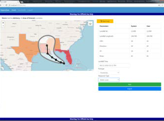
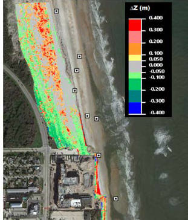

Methods to enable expedient, efficient, and effective data acquisition, data management and information dissemination for life-cycle public safety and all hazard risk mitigation, including rapidly deployed models and reliable damage assessment technologies.

<table style="width:100%", border="0", cellpadding="5">
<caption style="font-size: 20px">Fact Sheets</caption>
<tr>
<td align="left", valign="top">
<body>

  <a href="09.18_FY18_EmergencyManagement_CHRP_Nadal.pdf" target="_blank">• Coastal Hazard Rapid Prediction (CHRP)</a>

    
  

  <a href="06.19_FY19_EmergencyManagement_UAS_Brodie.pdf" target="_blank">• Unmanned Aerial Systems to support FRM</a>

</body>
</td>
<td id="mytable", rowspan="1">

  

</td>
</tr>
</table>
