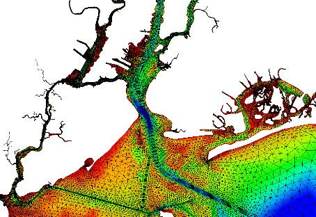

<table style="width:100%", border="0", cellpadding="5">
<caption style="font-size: 20px">Fact Sheets</caption>
<tr>
<td align="left", valign="center">
<body>

  <a href="06.19_FY19_ResilientCoastalSystems_UnstructuredWaveModeling_Smith.pdf" target="_blank">• Unstructured modeling of Coastal Waves</a>

</body>
</td>
<td id="mytable", rowspan="10">

  

  

</td>
</tr>

<tr>
<td align="left", valign="center">
<body>

  <a href="09.18_FY18_ResilientCoastalSystems_DuneBiomass_Bryant.pdf" target="_blank">• Benefits of Above & Below-ground Biomass on Dune Evolution</a>

</body>
</td>
</tr>

<tr>
<td align="left", valign="center">
<body>

  <a href="06.19_FY19_ResilientCoastalSystems_FUNWAVE_Malej.pdf" target="_blank">• FUNWAVE - A Phase-Resolving Nearshore Numerical Wave Model</a>

 
</body>
</td>
</tr>

<tr>
<td align="left", valign="center">
<body>

  <a href="09.18_FY18_ResilientCoastalSystems_AdH_Trahan.pdf" target="_blank">• Adaptive Hydraulics Development</a>

</body>
</td>
</tr>

<tr>
<td align="left", valign="center">
<body>

  <a href="06.19_FY19_ResilientCoastalSystems_NearshoreProcesses_Johnson.pdf" target="_blank">• Nearshore Processes</a>

</body>
</td>
</tr>

<tr>
<td align="left", valign="center">
<body>

  <a href="09.18_FY18_ResilientCoastalSystems_NNBF_Ding.pdf" target="_blank">• Resilience of Natural & Nature Based Features for FRM</a>

</body>
</td>
</tr>

<tr>
<td align="left", valign="center">
<body>

  <a href="06.19_FY19_ResilientCoastalSystems_CoastalDunes_Cohn.pdf" target="_blank">• Resilience of Coastal Dunes</a>

</body>
</td>
</tr>

<tr>
<td align="left", valign="center">
<body>

  <a href="">• CSTORM-MS</a>

</body>
</td>
</tr>

<tr>
<td align="left", valign="center">
<body>

  <a href="09.18_FY18_ResilientCoastalSystems_StochasticForcing_Nadal.pdf" target="_blank">• Stochastic Forcing for Coastal Structure Design</a>

</body>
</td>
</tr>

<tr>
<td align="left", valign="top">
<body>

  <a href="09.18_FY18_ResilientCoastalSystems_USCRP_Cialone.pdf" target="_blank">• Nearshore Advancements for the US Coastal Research Program</a>

</body>
</td>
</tr>
