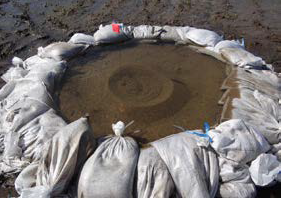
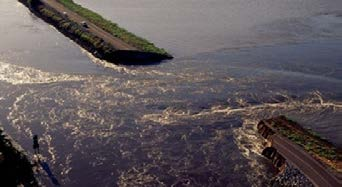
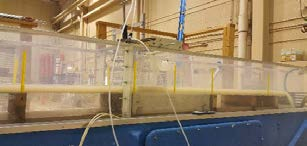

<table style="width:100%", border="0", cellpadding="5">
<caption style="font-size: 20px">Fact Sheets</caption>
<tr>
<td align="left", valign="center">
<body>

  <a href="06.19_FY19_ResilientInfrastructure_BalancedFloodStructureDesign_Ebeling.pdf" target="_blank">• Balanced Design of Flood Structures</a>

</body>
</td>
<td id="mytable", rowspan="9">

  

  

</td>
</tr>

<tr>
<td align="left", valign="center">
<body>

  <a href="06.19_FY19_ResilientInfrastructure_RemoteMonitoring_Dunbar.pdf" target="_blank">• Remote Monitoring & Sensing</a>

 
</body>
</td>
</tr>

<tr>
<td align="left", valign="center">
<body>

  <a href="09.18_FY18_ResilientInfrastructure_SandBoil_Robbins.pdf" target="_blank">• Sand Boil Formation & Mitgation</a>

</body>
</td>
</tr>

<tr>
<td align="left", valign="center">
<body>

  <a href="09.18_FY18_ResilientInfrastructure_TransientSeepage_Corcoran.pdf" target="_blank">• Transient Seepage Analysis</a>

</body>
</td>
</tr>

<tr>
<td align="left", valign="center">
<body>

  <a href="06.19_FY19_ResilientInfrastructure_InternalErosion_Robbins.pdf" target="_blank">• Internal Erosion</a>

</body>
</td>
</tr>

<tr>
<td align="left", valign="center">
<body>

  <a href="09.18_FY18_ResilientInfrastructure_SurfaceErosion_Corcoran.pdf" target="_blank">• Overtopping Erosion for Coarse-Grained Materials</a>

</body>
</td>
</tr>

<tr>
<td align="left", valign="center">
<body>

  <a href="06.19_FY19_ResilientInfrastructure_ExtremeHydrologicEvents_Karlovits.pdf" target="_blank">• Extreme Hydrology</a>

</body>
</td>
</tr>

<tr>
<td align="left", valign="center">
<body>

  <a href="06.19_FY19_ResilientInfrastructure_LeveeSystems_Schultz.pdf" target="_blank">• Development of Levee System Response Curves</a>

</body>
</td>
</tr>

<tr>
<td align="left", valign="center">
<body>

  <a href="06.19_FY19_ResilientInfrastructure_DamConduits_Netchaev.pdf" target="_blank">• Tools to Assess Dam Conduits</a>

</body>
</tr>
</td>
</table>
