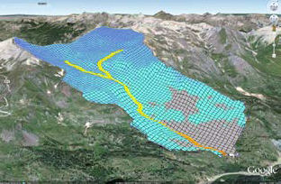
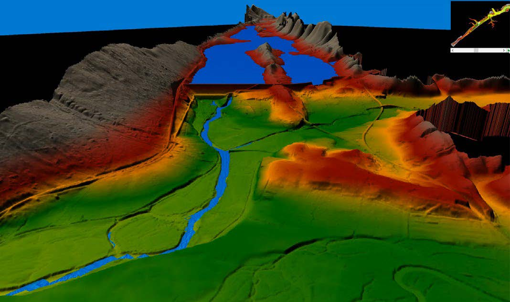

<table style="width:100%", border="0", cellpadding="5">
<caption style="font-size: 20px">Fact Sheets</caption>
<tr>
<td align="left", valign="center">

<body>

  <a href="09.18_FY18_WatershedManagement_GSSHA-HMS_Follum.pdf" target="_blank">• Enhancement of Snow and Frozen Ground in GSSHA and HMS</a>

</body>
</td>
<td id="mytable", rowspan="7">

  

</td>
</tr>

<tr>
<td align="left", valign="center">
<body>

  <a href="06.19_FY19_WatershedManagement_GSSHA-SEDLIB_Downer.pdf">• Integrated Watershed/Stream Sediment Simulation with GSSHA/SEDLIB</a>

 
</body>
</td>
</tr>

<tr>
<td align="left", valign="center">
<body>

  <a href="09.18_FY18_WatershedManagement_Wildfire_Floyd.pdf" target="_blank">• Post-Wildfire Hydraulics and Hydrology Numerical Modeling</a>

</body>
</td>
</tr>

<tr>
<td align="left", valign="center">
<body>

  <a href="06.19_FY19_WatershedManagement_ReservoirFlushing_Dahl.pdf" target="_blank">• Reservoir Flushing</a>

</body>
</td>
</tr>

<tr>
<td align="left", valign="center">
<body>

  <a href="06.19_FY19_WatershedManagement_HEC-HMS_Sanchez.pdf" target="_blank">• Enhanced Sediment Simulation with HEC-HMS</a>

</body>
</td>
</tr>

<tr>
<td align="left", valign="center">
<body>

  <a href="06.19_FY19_WatershedManagement_HEC-RAS_Development_Brunner.pdf" target="_blank">• HEC-RAS Improved Hydraulic Modeling/Application Efficiency</a>

</body>
</td>
</tr>

<tr>
<td align="left", valign="center">
<body>

  <a href="06.19_FY19_WatershedManagement_HEC-RAS_SedimentTransport_Gibson.pdf" target="_blank">• HEC-RAS Sediment Transport</a>

</body>
</tr>
</td>
</table>

