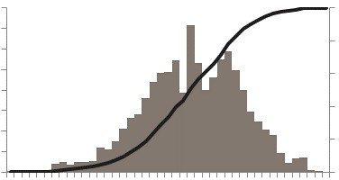
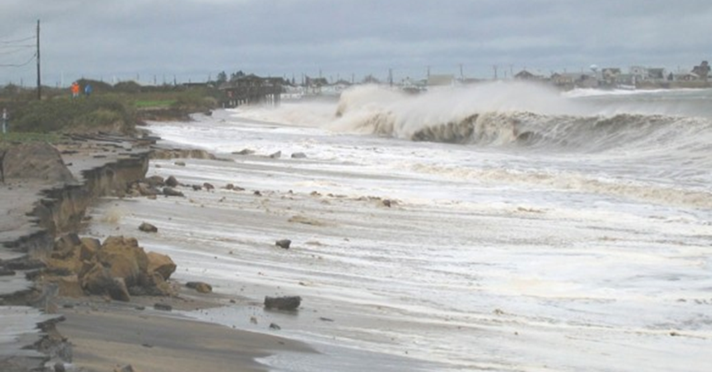
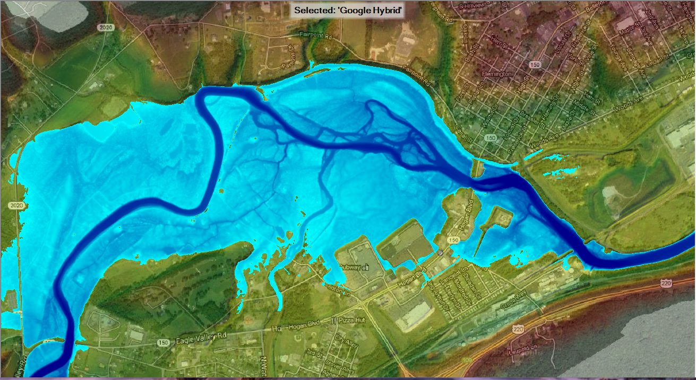
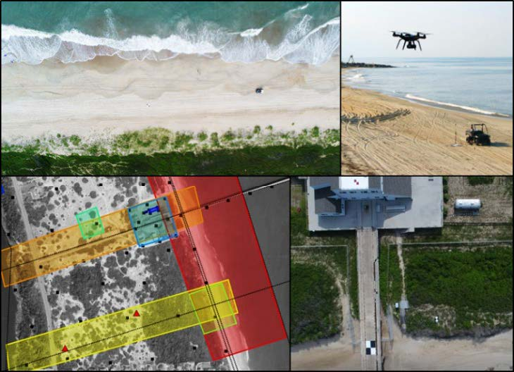

<table id="first_table" >
<tr>
<td>

As part of the Corps’ Coastal Storm and Flood Risk Management mission, the Corps is responsible for more than 700 dams, operates over 400 major lakes and reservoirs, maintains 8,500 miles of levees, and has over 100 coastal storm damage reduction and related projects. In the U.S., flooding and impacts from coastal storms cost approximately $4 billion annually. Consequently, over the past several years, federal coastal storm damage reduction expenditures increased to more than $100 million per year to protect the public and related economic investments.  
In managing flood and coastal storm damage reduction projects around the country for the public’s safety and benefit, the Corps’ challenge is to simultaneously optimize additional requirements for navigation, hydropower, water supply, environmental stewardship, and recreation while maintaining sustainable and adaptable watersheds. Challenges occur as existing infrastructure degrades with time, changing demographics increase the vulnerability of populations at risk, and environmental processes may increase intensity and frequency of extreme impacts. The Corps must have the most advanced capability to conduct risk-based assessments of alternative project designs and operational scenarios. Those capabilities must be robust, reliable, and comprehensive and lead to sustainable solutions.

</td>
<td>
</img>
</td>
</tr>
</table>

<table id="index_table">
<caption style="padding-left: 6px; font-size: 16px">The Flood & Coastal Systems (F&CS) R&D Program provides science, engineering, and technologies to reduce risk of flood & coastal damages, increase watershed resilience, and advance sustainable infrastructure on systems-scales.</caption>
<tr>
<td>

 
<a href="AARU.html" style="font-size:18px">Alternative Analysis Risk & Uncertainty</a>

</td>
<td>

 
<a href="RCS.html" style="font-size:18px">Resilient Coastal Systems</a>
</td>

<td>

 
<a href="WM.html" style="font-size:18px">Watershed Mangement</a>
</td>

<td>

 
<a href="RI.html" style="font-size:18px">Resilient Infrastructure</a>
</td>

<td>

 
<a href="EM.html" style="font-size:18px">Emergency Management</a>
</td>

</tr>
</table>
